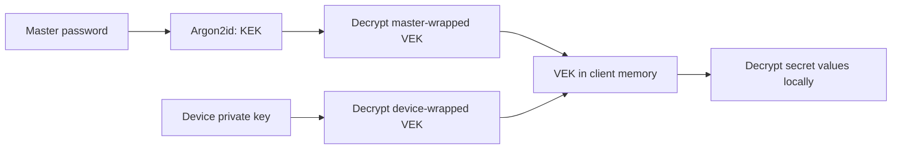

# How Hush encryption works

Hush encrypts secret values on your device before synchronizing them with Cloudflare. The Worker stores encrypted values and encrypted copies of the vault key. The current Vue Web admin and Go CLI share [cryptographic format 1](../contracts/crypto.md).

This page explains the flow. The protocol document specifies exact byte encodings, authenticated fields, envelope sizes, and interoperability fixtures.

## The keys

| Key or credential          | Purpose                                          | Where it lives                                                              |
| -------------------------- | ------------------------------------------------ | --------------------------------------------------------------------------- |
| Master password            | Recover access to the vault key in the Web admin | Held by you; never sent to the Worker                                       |
| Key encryption key (KEK)   | Encrypt the master-wrapped vault key             | Derived from the password locally, then discarded                           |
| Vault encryption key (VEK) | Encrypt and decrypt secret values                | Plaintext only in client memory; encrypted copies are stored by the service |
| Device keypair             | Unwrap the vault key on a trusted device         | Public key on the service; private key on the device                        |
| Access credentials         | Authenticate requests to the service             | Browser Access session or CLI Service Token; separate from encryption keys  |

The master-password and device-key paths are alternatives. After enrollment, the CLI uses its device key and does not need the master password.

## Creating and unlocking a vault

When you create a vault, the browser generates a random 32-byte VEK. It derives a KEK from the master password using Argon2id with a random salt, 64 MiB memory, three iterations, and parallelism one. The KEK encrypts the VEK with AES-256-GCM; the resulting **master-wrapped VEK**, salt, and KDF parameters are uploaded.

The browser encrypts each secret independently with the VEK using AES-256-GCM and a fresh random 12-byte nonce. Authentication binds a secret's ciphertext to its vault ID, secret ID, secret version, and key version. Changing those fields or the ciphertext causes authentication to fail.

When unlocking with a password, the browser repeats the key derivation and decrypts the master wrap locally. The Worker never receives the password, KEK, or plaintext VEK in this flow.

## Enrolling a device

`hush init` generates an X25519 device keypair locally. You copy its public registration information into Web admin. The unlocked browser encrypts the VEK for that public key using HPKE with X25519, HKDF-SHA256, and AES-256-GCM, then stores the device wrap on the service.

The device private key stays on the machine. The CLI stores it with its Access credentials in a private file for unattended use. A trusted browser stores a non-extractable device private key in IndexedDB instead.

The Access Service Token authorizes API requests. It is not a decryption key: a copied token without the device private key is insufficient to unwrap the VEK. Conversely, possession of the local CLI credential file supplies both parts needed for routine access.

## Running a command

For `hush exec github -- gh api user`, the CLI:

1. Authenticates to the service and finds the `github` Profile.
2. Fetches its device-wrapped VEK and the Profile's encrypted secrets, checking that the key and secret reads have matching vault revisions.
3. Unwraps the VEK with its private key and authenticates/decrypts every selected secret.
4. Starts the command with those values mapped to environment variables only after all checks succeed.

No vault-content cache or plaintext VEK is intentionally saved to disk. Each invocation needs the service. Environment variables are available to the command; Hush cannot prevent that command from printing or exporting them.

## Password changes and key rotation

**Changing the master password** derives a new KEK with a new salt and re-wraps the existing VEK. Secret ciphertext and device wraps remain unchanged. Someone who retained an old database copy can still try the old password against that copy; changing the password alone does not revoke a previously exposed VEK.

**Rotating the vault key** generates a new VEK, decrypts and re-encrypts every current secret in the browser, and creates new master and active-device wraps. The complete update is published atomically against the current vault revision. Revoked devices do not receive new wraps.

Rotation cannot retract plaintext already read, and re-encrypting an exposed API token does not change the token at its provider. Replace compromised external credentials as well.

## What a database copy reveals

A database copy contains secret ciphertext, encrypted key wraps, and readable metadata. Without a usable device private key or the master password, it does not directly expose secret values. However, the stored master wrap permits **offline password guessing**: an attacker can try candidates without contacting Hush or passing Access authentication. Argon2id raises the cost of each attempt; use a long, unique, high-entropy password.

Secret names, Profile names and environment mappings, device public keys, timestamps, and audit metadata are not encrypted. Ciphertext length also reveals the secret's byte length plus the authentication tag; the protocol does not pad values.

## Trust boundaries

The intended confidentiality model covers someone obtaining the service database. Hush still trusts your devices and the delivered Web application code. Malicious same-origin JavaScript can misuse browser keys even when they are non-extractable. The protocol does not provide an independently authenticated device directory or protection against a malicious service replaying old snapshots.

Service-side revision checks and nonce ledgers prevent supported clients from publishing stale writes or known nonce reuse. They do not establish trust in a hostile server. Likewise, revocation prevents future authorized reads but cannot erase data already obtained by a device.

For exact algorithms, AAD construction, and envelope examples, see the [format-1 protocol](../contracts/crypto.md). Tests check the same public vectors in JavaScript and Go; fixture private keys are test data, never production keys.
